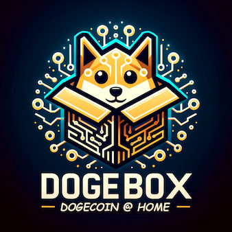

<div align="center">
  
  <p>DOGEBOX is a NixOS distribution that runs the Dogebox Runtime Environment</p>
</div>

> [!CAUTION]  
> Dogebox is currently in a pre-alpha developer preview. Do not use it for any production workloads, and definitely don't send any money to addresses generated by it.


## What is Dogebox 
Dogebox is a Linux OS with a web-based management interface and permission-based routing and container system designed to 
provide a platform and DRE (Dogecoin Runtime Environment) for building services and apps on top of the Dogecoin blockchain.

Services & applications packaged for Dogebox are called 'pups', these are standard linux services that are executed in
isolated containers, with access to other 'pups' and the Dogecoin blockchain via ACL/Permission controlled internal routing.

## Getting It

Builds are available on our [Github Releases](https://github.com/dogeorg/dogebox/releases) page.

> [!NOTE]
> All releases currently have hardcoded credentials until we work on SSH management. These are `shibe:suchpass`

## Running It

Currently, only "virtual machine" images are being released. We plan to release ARM (`aarch64`) and `x86_64` compatible hardware images over the next couple of weeks.

See details below for specific setups:

<details>
  <summary>Running in QEMU</summary>

1. First, grab the latest QEMU release.

2. Launch the image with the following command:

```bash
qemu-system-x86_64 \
-drive file=dogebox.qcow2,format=qcow2 \
-m 4G \
-smp 2 \
-nographic \
-netdev user,id=net0,hostfwd=tcp::2222-:22 \
-device virtio-net,netdev=net0
```

</details>

<details>
  <summary>Running in VMWare</summary>

TODO :)

</details>

<details>
  <summary>Running in Virtualbox</summary>

1. Install Virtualbox :)
2. Run `make virtualbox-launch`

</details>

<details>
  <summary>Running on Proxmox</summary>

TODO :)

</details>

## Issues

If you're struggling to get something working, please open a github issue with a description of the problem.

## Contributing

If you want to contribute, please check the current [roadmap](https://docs.google.com/spreadsheets/d/1FfJ_c-PjJdzkTAB3QFmDd2PRadrtNgvOhuDJTBEeOWU/view?gid=759122314#gid=759122314), and join our [discord server](https://discord.gg/VEUMWpThg9) to start chatting with other developers.
